Git是什么？

Git是目前世界上最先进的分布式版本控制系统（没有之一）。

#什么是版本控制系统?

- 没有版本控制系统


- 有了版本控制系统

| 版本 | 文件名      | 用户 | 说明                   | 日期       |
| ---- | ----------- | ---- | ---------------------- | ---------- |
| 1    | service.doc | 张三 | 删除了软件服务条款5    | 7/12 10:38 |
| 2    | service.doc | 张三 | 增加了License人数限制  | 7/12 18:09 |
| 3    | service.doc | 李四 | 财务部门调整了合同金额 | 7/13 9:51  |
| 4    | service.doc | 张三 | 延长了免费升级周期     | 7/14 15:17 |

- 版本控制工具的作用:保存工作副本  保留代码更改的历史记录  在需要时返回到工作版本(代码回滚)  分支管理  代码合并

#常见版本控制系统  

- 集中式

  特点:只有一台版本服务器

  

  ​

  缺点:必须联网才能工作

  ​

  - CVS是最早的开源而且免费的集中式版本控制系统	
  - SVN修正了CVS的一些稳定性问题
  - IBM的ClearCase:安装大  速度慢 
  - 微软VSS(Visual Source Safe)

- 分布式

  特点:每个人的电脑都是服务器   强大的分支管理  

  

  ​

  - git
  - BitKeeper
  - Mercurial和Bazaar

  ​

# git的诞生


​							Linus Torvalds

Linus在1991年创建了开源的Linux，已经成为最大的服务器系统软件了。

Linus虽然创建了Linux，但Linux的壮大是靠全世界热心的志愿者参与的


那Linux的代码是如何管理的呢？

- 在2002年以前，手工方式合并代码！

  集中式的CVS和SVN速度慢,需要联网

  商用的版本控制系统,需要付费,不符合linux的开源精神

- 2002年，使用BitKeeper(属于BitMover公司)

- 2005年BitMover收回linux社区免费使用权

- Linus花了两周时间自己用C写了一个分布式版本控制系统，这就是Git

  一个月之内，Linux系统的源码已经由Git管理了！牛是怎么定义的呢？大家可以体会一下。

  Git迅速成为最流行的分布式版本控制系统，尤其是2008年，GitHub网站上线了，它为开源项目免费提供Git存储

  ​

# 安装git

Git可以在Linux、Unix、Mac和Windows这几大平台上正常运行了。

## 在Linux上安装Git

- 输入`git`，查看git是否安装

```
$ git
The program 'git' is currently not installed. You can install it by typing:
sudo apt-get install git
```

## 在Mac OS X上安装Git

- 一是安装homebrew，然后通过homebrew安装Git，具体方法请参考homebrew的文档：<http://brew.sh/>。
- 第二种方法更简单，也是推荐的方法，就是直接从AppStore安装Xcode，Xcode集成了Git，不过默认没有安装，你需要运行Xcode，选择菜单“Xcode”->“Preferences”，在弹出窗口中找到“Downloads”，选择“Command Line Tools”，点“Install”就可以完成安装了。


Xcode是Apple官方IDE，功能非常强大，是开发Mac和iOS App的必选装备，而且是免费的！

## 在Windows上安装Git

- git下载地址 https://git-scm.com/downloads
- 右键Git  Bash通过git命令查看是否成功
- 右键Git  Bash通过git version查看版本

## 自我介绍给git

每次 Git 提交时都会引用这两条信息，说明是谁提交了更新

```
git config --global user.name "Yakov Fain"
git config --global user.email "yakovfain@gmail.com"
```

| **   | 如果您希望能够为不同的项目使用不同的用户名和电子邮件，请在没有*--global*选项的情况下从项目目录运行上述命令。 |
| ---- | ------------------------------------------------------------ |
|      |                                                              |

- 查看用户信息`git config --list`

# 创建版本库repository

版本库:可以简单理解成一个目录,这个目录里的所有文件都可以被git管理起来,每个文件的修改、删除，Git都能跟踪，以便任何时刻都可以追踪历史，或者在将来某个时刻可以“还原”。

- 首先创建一个项目的目录

- 目录下执行git init

  ```
  $ git init
  Initialized empty Git repository in /Users/michael/learngit/.git/
  ```

  通过`git init`命令把这个目录变成Git可以管理的仓库：

  目录下多了一个`.git`的目录，这个目录是Git来跟踪管理版本库的

  如果没有看到`.git`目录，因为这个目录默认是隐藏的，用`ls -ah`命令即可看见

- 接下来就可以在当前文件夹创建项目文件,比如:Fish.java  Pet.java  PetMaster.java

# 忽略文件

编译的中间文件比如class这些文件我们不需要上传到git,就可以通过忽略文件来实现

- 工程目录下执行`touch .gitignore`生成忽略文件

- 在文件中定义忽略的内容,写法如下

  https://github.com/github/gitignore

- 忽略的标准

1. 忽略操作系统自动生成的文件，比如缩略图等；
2. 忽略编译生成的中间文件、可执行文件等，也就是如果一个文件是通过另一个文件自动生成的，那自动生成的文件就没必要放进版本库，比如Java编译产生的`.class`文件；
3. 忽略你自己的带有敏感信息的配置文件，比如存放口令的配置文件。


# 状态命令

- git  status

  查看自从我上次向Git存储库提交更改以来修改了哪些文件

  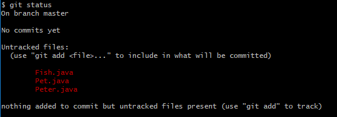

  红色的文件是未跟踪的文件

注意:

> 版本控制系统只能跟踪文本文件的改动
>
> 二进制文件没法跟踪文件的变化(只知道改变了大小,不知道具体改了什么)

# 把文件添加到版本库

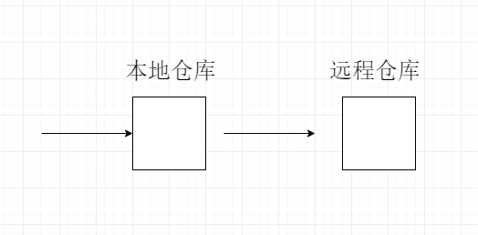

把大象放到冰箱需要3步，把一个文件放到Git仓库只需要两步。


## 添加命令(文件内容到索引)添加到购物车

- 使用`git add`

  ```
  $ git add Fish.java
  ```

  ​

- 一次添加多个`git add --all`

  ```
  $ git add --all
  ```


添加完之后,可以再次执行`git status`命令查看状态

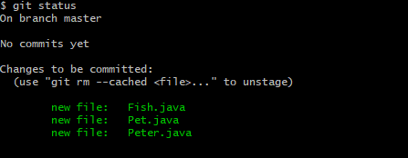


## 提交命令(购物车统一结账)

- `git commit -m "第一次提交"`

  注:`-m`后面的是这一次的提交说明

  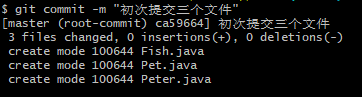

  ​

## 提交记录查看

- `git log`查看完整提交记录

  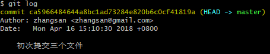

- `git log -n`查看最近n次提交记录

  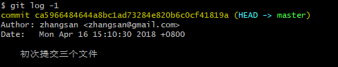

  注:commit后面的一串字符是`commit id`版本号,SHA1计算

## 小结

初始化一个Git仓库，使用`git init`命令。

添加文件到Git仓库，分两步：

- 第一步，使用命令`git add <file>`，注意，可反复多次使用，添加多个文件；
- 第二步，使用命令`git commit`，完成。

查看提交记录:`git log`以及`git log -n`


# 版本管理

## 版本回退

- 当前版本往上回退版本`git reset --hard HEAD^`

  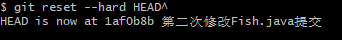

- 往上回退n个版本`git reset --hard HEAD~n`

  

- 回退到某一个版本:`git reset  --hard commit id`

  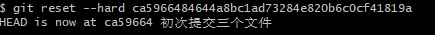

- 如果回退之后后悔,想恢复到最新版本

  - 通过`git reflog`查看每一次记录

    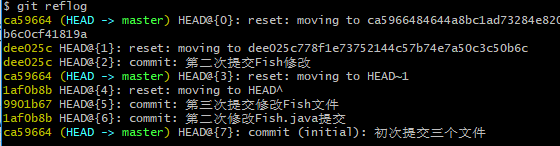

  - 回退到指定的`commit id`

    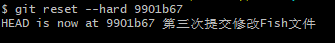

    ​

### 小结

- `HEAD`指向的版本就是当前版本
- 使用命令`git reset --hard HEAD^`回退一个版本
- 使用命令`git reset --hard HEAD~n`回退n个版本
- 使用命令`git reset --hard commit_id`。
- 要重返未来，用`git reflog`查看命令历史，以便确定要回到未来的哪个版本。


# 分支管理

每一个开发人员都有一个分支,通常还有div分支以及master分支

## 创建与删除分支

- 查看当前分支`git branch`

  ```
  $ git branch
  * master
  ```


- 创建并切换分支`git checkout -b mary `

  ```
  $ git checkout -b mary
  Switched to a new branch 'mary'
  D       Pet.java
  ```

  这个相当于两个命令

  `git branch mary`创建mary分支

  `git checkout mary`切换到mary分支

- 删除分支`git branch -d mary`

  ```
  $ git branch -d mary
  Deleted branch mary (was 9901b67).
  ```

  ​

## 合并分支

把mary开发的代码合并到master主分支上

- master主分支执行`git merge mary`

  mary分支增加了Haha.java

  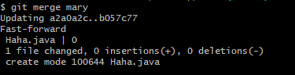

  没有冲突是Fast-forward快进模式

## 解决冲突

首先张三从zhangsan分支提交了对Pter.java的修改,修改内容如下

```
class Peter{
	int a = 10;
}
```

并把修改合并到主分支


mary开发中也对Peter.java进行了修改,修改如下

```
class Peter{
	String name = "mary";
}
```

想要把mary分支合并到主分支master,就会出问题

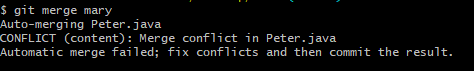

这里就会说明有冲突


代码中也会出现提示

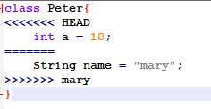

HEAD代表当前分支版本,mary代表mary分支


解决方案就是修改冲突并再次提交


# 远程仓库github

[GitHub](https://github.com/)是一个基于Web的Git仓库托管服务，在这里您可以免费创建一个共享的代码仓库。希望在GitHub上创建私有存储库的人或组织可以购买付费帐户。

http/ssh

- 第1步：创建SSH Key。

  在用户主目录下，看看有没有.ssh目录，如果有，再看看这个目录下有没有`id_rsa`和`id_rsa.pub`这两个文件。如果没有,执行下面命令，创建SSH Key：

  ```
  $ ssh-keygen -t rsa -C "youremail@example.com" 
  ```

  建议使用真实的邮箱地址

  `id_rsa`是私钥，`id_rsa.pub`是公钥

- 第2步：登陆GitHub，打开“settings”，“SSH Keys”页面：

  然后，点“New SSH Key”，填上任意Title，在Key文本框里粘贴`id_rsa.pub`文件的内容：

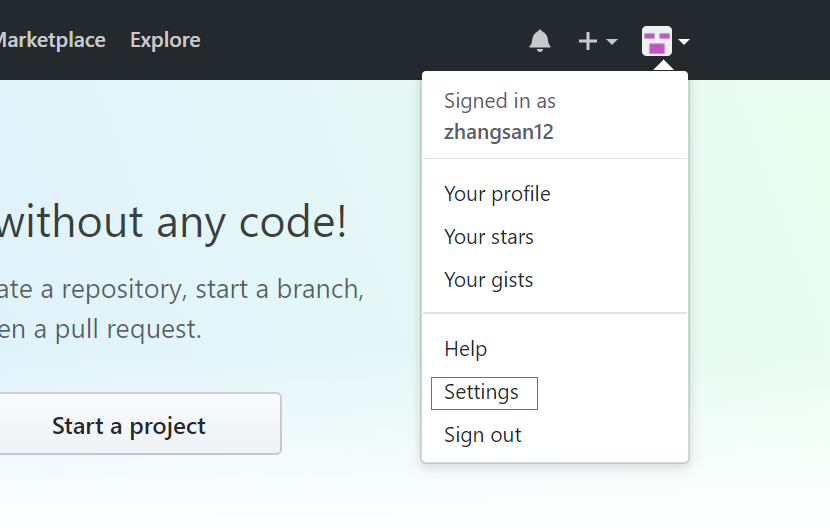


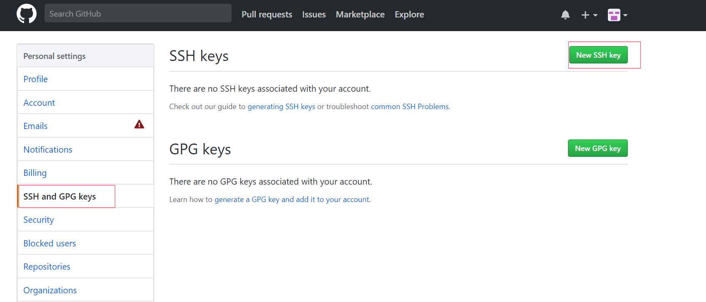


##创建远程仓库

- 首先，登陆GitHub，在右上角找到“newrepository”按钮，创建一个新的仓库

  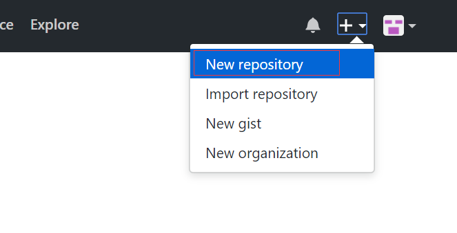

- 在Repository name填入f`irstgit`仓库名，其他保持默认设置

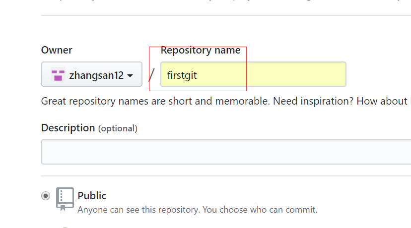

##添加远程仓库

目前`firstgit`仓库还是空的，我们可以从这个仓库克隆出新的仓库，也可以把本地仓库与之关联，然后把本地仓库的内容推送到GitHub仓库。

- 本地仓库关联远程仓库  `git remote add origin SSH`

  ```
  $ git remote add origin git@github.com:zhangsan12/firstgit.git
  ```

  

## 推送到远程仓库

- 推送到远程仓库`git push -u origin 分支`

  ```
  $ git push -u origin master
  ```

  把当前分支`master`推送到远程`master`分支。`-u`会把本地`master`分支和远程`master`分支关联起来

  下一次再提交的话就可以简便

  ```
  $ git push origin master
  ```

  ​

### 推送分支

推送分支，就是把该分支上的所有本地提交推送到远程库。推送时，要指定本地分支，这样，Git就会把该分支推送到远程库对应的远程分支上：

```
$ git push origin master

```

如果要推送其他分支，比如`dev`，就改成：

```
$ git push origin dev

```


### SSH警告

第一次使用Git的`clone`或者`push`命令连接GitHub时，会得到一个警告：

```
The authenticity of host 'github.com (xx.xx.xx.xx)' can't be established.
RSA key fingerprint is xx.xx.xx.xx.xx.
Are you sure you want to continue connecting (yes/no)?
```

原因:需要你确认GitHub的Key的指纹信息是否真的来自GitHub的服务器，输入`yes`回车即可。


### 小结

关联远程库:`git remote add origin git@server-name:path/repo-name.git`

第一次推送master分支:`git push -u origin master`

后面推送最新修改:`git push origin master`


## 从远程库克隆

- 项目找到`clone or download`按钮,选择地址

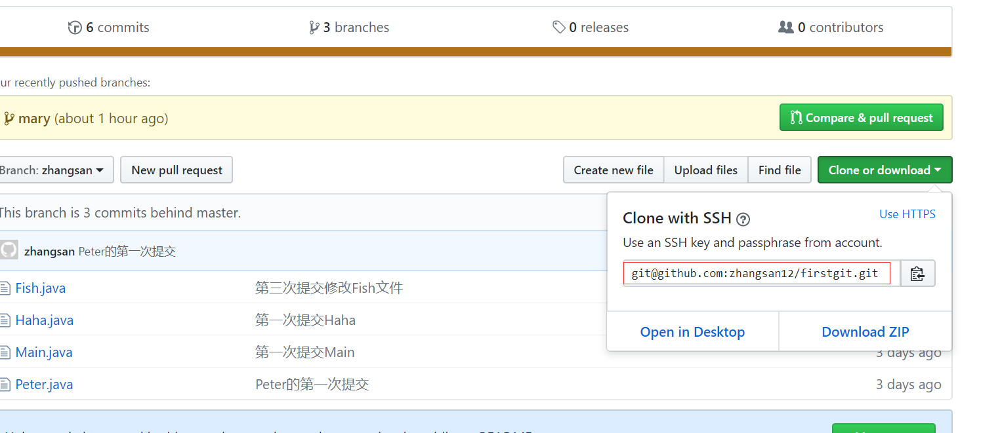

- 使用命令`git clone`克隆一个本地库

  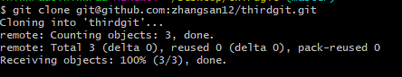

  多人协作开发，每个人从远程克隆一份即可。

- 克隆其他分支

  - 查看远程分支`git branch -a`
  - 切换分支`git checkout 分支`

### 小结

要克隆一个仓库，首先必须知道仓库的地址，然后使用`git clone`命令克隆。

Git支持多种协议，包括`https`，但通过`ssh`支持的原生`git`协议速度最快。

## 多人协作

- 查看远程库的信息`git remote`：

```
$ git remote
origin
```

### 抓取分支

多人协作时，大家都会往`master`和`dev`分支上推送各自的修改。

- 现在，模拟一个你的小伙伴，可以在另一台电脑（注意要把SSH Key添加到GitHub）或者同一台电脑的另一个目录下克隆：


- 其他小伙伴从远程库clone并且在`master`上继续修改，然后，时不时地把`master`分支`push`到远程：


- 你的小伙伴已经向`origin/master`分支推送了他的提交，而碰巧你也对同样的文件作了修改，并试图推送：

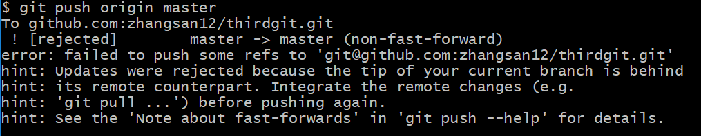


- 推送失败，因为你的小伙伴的最新提交和你试图推送的提交有冲突，解决办法也很简单，Git已经提示我们，先用`git pull`把最新的提交从`origin/master`抓下来，然后，在本地合并，解决冲突，再推送：

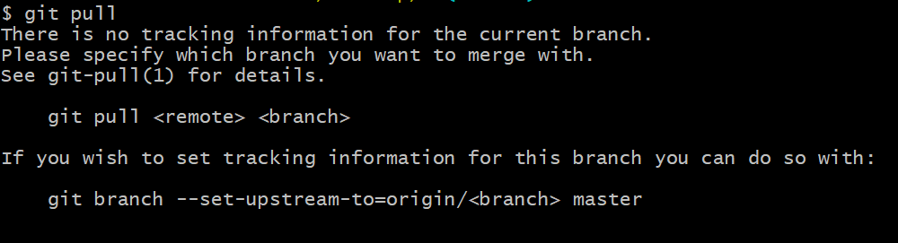


- 如果`git pull`失败，原因是没有指定本地`master`分支与远程`origin/master`分支的链接，根据提示，设置`master`和`origin/master`的链接：


再pull：

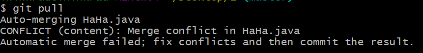

`git pull`成功，但是合并有冲突，需要手动解决，解决的方法和分支管理中的[解决冲突](http://www.liaoxuefeng.com/wiki/0013739516305929606dd18361248578c67b8067c8c017b000/001375840202368c74be33fbd884e71b570f2cc3c0d1dcf000)完全一样。解决后，提交，再push：

###总结

多人协作的工作模式通常是这样：

1. 首先用`git pull`拉取最新代码试图合并；
2. 如果合并有冲突，则解决冲突，并在本地提交；
3. 解决掉冲突后，再用`git push origin branch-name`推送

如果`git pull`提示“no tracking information”，则说明本地分支和远程分支的链接关系没有创建，用命令`git branch --set-upstream-to=origin/branch-name branch-name`。

这就是多人协作的工作模式，一旦熟悉了，就非常简单。

### 小结

- 本地新建的分支如果不推送到远程，对其他人就是不可见的；
- 从本地推送分支，使用`git push origin branch-name`，如果推送失败，先用`git pull`抓取远程的新提交；
- 在本地创建和远程分支对应的分支，使用`git checkout -b branch-name origin/branch-name`，本地和远程分支的名称最好一致；
- 建立本地分支和远程分支的关联，使用`git branch --set-upstream branch-name origin/branch-name`；
- 从远程抓取分支，使用`git pull`，如果有冲突，要先处理冲突。


