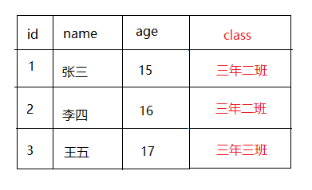
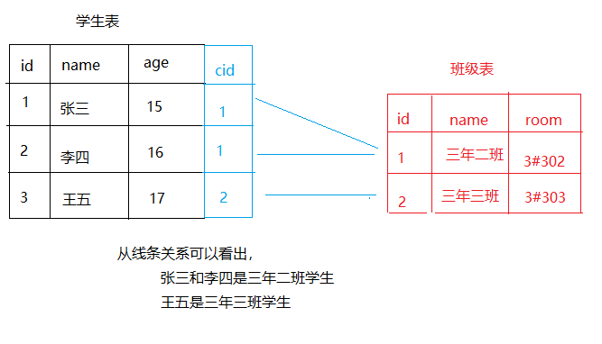
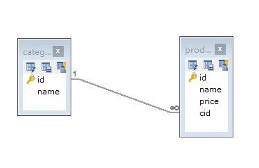
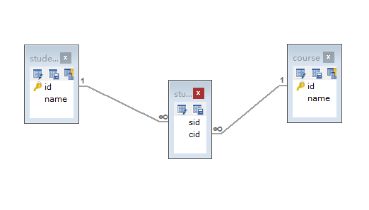
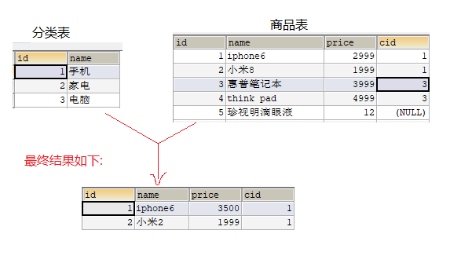
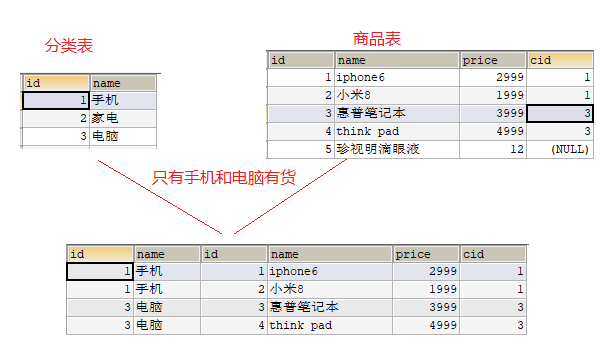
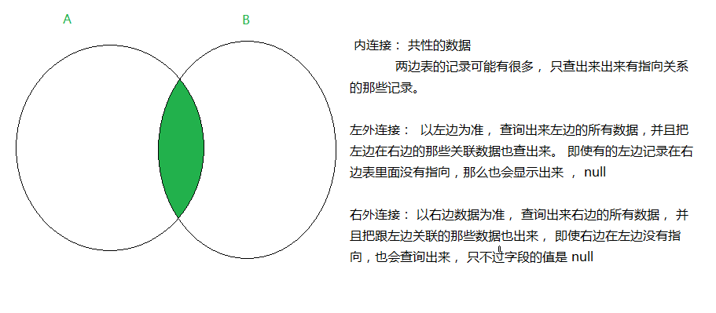
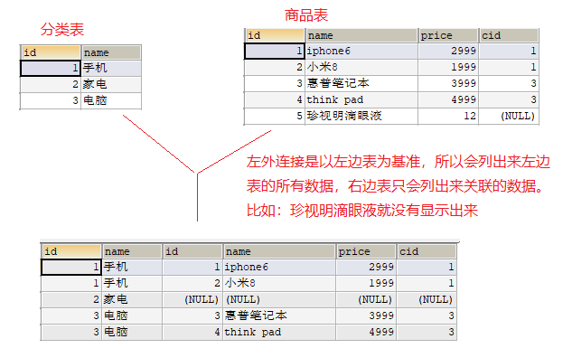
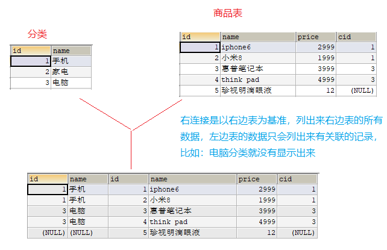

* 多表关系

## 一、表关系介绍

###1. 表之间为什么要有关系 

> 一般来讲，通常都是一张表某一类型数据，比如学生数据存储在学生表，教师数据存储在教师表，学科数据存储在学科表。但是有时候我们需要表示一个学生属于哪一个班级。我们可以有两种形态表示，
>
> 一、直接在学生表里面表示属于哪一个班级。（@1） 如果我们还想表示班级更多的信息。  class表。
>
> 二、学生表表示学生信息，班级表表示班级信息，然后让学生表和班级表存在关系引用即可。
>
> 从扩展角度来看，应该是第二种方式更优秀一点，因为如果我们要扩展班级的信息，比如，位于哪个教室，班主任是谁等等信息 ，第一种方式就显得捉襟见肘，如果都把这些要扩展的信息声明在学生表里面，就打破了数据的完整性。

* 图1

* 图2

### 2. 表关系维系的点

> 一般数据表就表示某一种类型的数据。比如： 学生表、班级表。如果要让两张表存在关系，必须得有维系关系的点存在。就好比生活中怎么表示对面这位美女就是你的夫人呢？把结婚证拿出来一摆就可以了。
>
> 数据库表形成关系，并不需要额外的第三方物件来表示。只要某一张表中的某一列存放的是另一张表的一个标识即可（一般是主键id。） ， 如下图表示一个学生是哪一个班级的。则需要在学生表中使用一个列cid 来存储班级的id值。 以后查询学生信息的时候，即可知道它属于的班级id。 
>
> 当某一列中存放的值是另一个表的主键值，那么这个列一般会称之为外键 `如：学生表的 cid列`， 所以一般表的关系，我们也可以看成是主外键关系。 

~~~aa
一旦形成主外键关系，那么外键里面的值只能是主键值，否则就无法形成主外键关系了。如：我们在cid中写了100这个数字，这就表示必须存在编号为100的班级，否则该学生的数据就是无效的数据。一般会称外键方为从表，主键方为主表
~~~

* 思维拓展

> 表示学生属于哪一个班级，就在学生表里面增加一个列cid , 然后cid 就存放班级表的id值。 已上图距离， 张三就属于三年二班的学生
>
> 
>
> 如果要表示这个班级有哪些学生，我们如何在班级表这边体现呢？ 从群体关系上看，班级只有一个，学生有很多个。在班级里面体现学生是很难的。假如一个班有100个学生，那么班级表真的很难记住这100个学生的信息。我们只有在学生的这边记住，它属于哪一个班级。 基本上这和我们日常生活是一样的。只有多的一边记住多的一边， 一的那边很少记住多的一边。如： 我们都知道高中校长、大学校长。但是校长就很难记住我们...
>
> 要记住一个核心点： 就是在分析表关系的时候，要分清楚多的一边，和 一的一边。 然后在多的一边，建立外键，然后指向一的那一边的主键值。
>
> 

### 3. 表关系分类

> 表关系的分类主要体现以下几种：  `一对多 ` |   `多对一` 、`多对多` 、` 一对一` 。表关系是数据库操作中高阶的知识，开发中经常会碰到。

* 一对多 | 多对一

> 在生活中体现的有，商品分类 和 商品的关系 ，班级和学生的关系 ， 教练和队员的关系... 其实`一对多`的关系反向过来是`多对一`，所以平常也有可能听到多对一这样的关系，其实也是成立的。只不过是谁在前，谁在后而已。 

* 多对多【拆解成两个一对多】

> 多对多，其实就是两个一对多组合一起。生活中最能体现这个就是学生选课这个事情了。 A 这个课程有 多个学生选择， 一个学生也可以选择多们课程。 学生选课的关系：  一个学生可以选择多门课程 ，一门课程也可以被多个学生选。

* 一对一【比较少见】

> 一对一的关系生活中体现比较少，除了那种一对一辅导、保姆专人照顾婴儿之外，貌似就比较少...

### 4. 一对多关系

> 此处使用商品分类 &  商品来体现一对多关系

~~~mysql
-- 分类表
CREATE TABLE category (id INT PRIMARY KEY AUTO_INCREMENT , NAME VARCHAR(20) );

-- 商品表
CREATE TABLE product (id INT PRIMARY KEY AUTO_INCREMENT , NAME VARCHAR(20) , price DOUBLE);

-- 添加外键字段，意思是给商品添加一个额外的字段。
ALTER TABLE product ADD COLUMN cid INT ;

-- 添加额外的约束 意思是给product表添加一个外键约束
-- 约束的名称叫做product_fk  这个名字可以随便写。 外键是是cid . 
-- 后面的REFERENCES 表示和哪一个表的哪一个列建立关系。 
ALTER TABLE product ADD CONSTRAINT product_fk FOREIGN KEY (cid) REFERENCES category(id);
~~~

### 5. 多对多关系

> 这里使用学生选课的情形来描述 ，但是多对多比以前的一对多 或者 多对一稍显复杂些。 一般多对多都会使用第三张表来周转，把多对多变成两个一对多的关系。

~~~mysql
-- 创建学生表
CREATE TABLE student(id INT PRIMARY KEY AUTO_INCREMENT , NAME VARCHAR(20));

-- 创建课程表
CREATE TABLE course (id INT PRIMARY KEY AUTO_INCREMENT , NAME VARCHAR(20));

 -- 创建中间表  中间表独立使用没有任何意义，它得配合其他的两张表来使用才能体现出来。所以
 -- 该表可以没有主键。当然假如主键也没有什么问题
 CREATE TABLE stu_course(sid INT, cid INT);
 
 -- 创建学生表和中间表的关系。 原则上学生表和课程是多对多的关系，一个学生可以选择多门课程 ， 那么学生和
 -- 中间选课记录表的关系应该是一对多的关系。 那么记录表作为多的一方，需要去记住一的一方
 ALTER TABLE stu_course ADD CONSTRAINT stu_fk  FOREIGN KEY (sid) REFERENCES student(id);
 
 -- 添加中间表到课程表的一用。
 ALTER TABLE stu_course ADD CONSTRAINT course_fk FOREIGN KEY(cid) REFERENCES course(id);
~~~

* 为什么多对多要引入中间表?

> 由于学生表只会存放学生信息， 课程表也只会存放课程信息。 那么要体现一个学生选择了几门课程，一门课程被多少个学生选择。 如果没有中间表，我们就需要在这两张表中各自添加额外的列来记录这些数据（如，选课的时间）。 这就使得数据表不是那么的干净。通用的做法都是采用中间表存放他们的各自关系，然后让学生表、课程表  和 中间表产生关系即可。

## 二、 多表查询

> 此前我们创建的表都是独立的表，现在表之间已经存在了联系，那么现在的查询要再上一个台阶，要使用到多表联合查询了。通俗的意思就是：查询A表 和 B表，然后才能得出一条完整的数据。 以前由于数据是独立的，所以查询A表即可得知一条完整的数据。

* 多表查询的分类

> 多表查询的常用手段有 ： `子查询` | `内连接查询`  |`外连接查询` 

### 1. 子查询

>  子查询是将一个查询语句嵌套在另外一个查询语句中，内层查询语句的查询结果，可以为外层查询语句提供查询条件 。 

* 语法规则

1. 子查询必须“自身就是一个完整的查询”。即，它必须至少包括一个SELECT子句和FROM子句。
2. 子查询SELECT语句不能包括在ORDER BY子句中。因为ORDER BY字句只能对最终查询结果排序，如果显示的输出需要按照特定顺序显示，那么ORDER BY子句应该作为外部查询的最后一个子句列出。
3. 子查询“必须包括在一组括号中”，以便将它与外部查询分开。

* 例子

~~~sql
-- 把商品分类为手机的所有商品给查询出来。 

--1. 首先要查询出来商品分类为 【手机】 的信息。
-- 商品表里面，表示分类信息，只有一个分类id , 所以上一个步骤，要查询出来【手机】的分类id
SELECT id FROM category WHERE NAME='手机';

--2. 根据查询出来的分类id来查询所有商品。  这里使用子查询， 前面查询到的id 作为这次查询的条件。
SELECT * FROM product WHERE cid = (SELECT id FROM category WHERE NAME='手机');
~~~

### 2. 内连接查询

> 内连接查询是一种常用的连接查询，可以查询两个或两个以上的表。该查询后面必须有两张表的对等值才能成立。 如：仓库中有哪一种分类有库存的，并且列出库存商品。
>
>  内连接有两种分类： `隐式内连接`  | `显式内连接`

* 隐式内连接

> 语法格式：select * from A , B where 条件 ； 

~~~mysql
-- 需求：查询商品库中，哪一种分类有商品，并且都有哪些商品。
SELECT  c.name , p.name , p.price FROM category c ,product p WHERE p.cid = c.id;
~~~

* 显式内连接

> 语法格式：select * from A inner join B on 条件

~~~sql
SELECT  c.name , p.name , p.price FROM category  c INNER JOIN product p ON p.cid = c.id;
~~~

### 3. 外连接查询

> 外连接查询又分为`左外连接`和`右外连接`

####1. 左外连接

> 以左边表为基准，查询左边表的所有数据，顺便把它里面关联的右边表数据给查询出来，即便左边表中有某些记录在右边表没有关联，那么也会查询出来，只不过关联的部分值为null而已。     
>
> 使用关键字: `LEFT  JOIN`或`LEFT OUTER JOIN     `
>
> 此处以 ： ***列出仓库中所有分类 以及 每一种分类具体的商品信息***  为例子演示 ， 此处优先的是分类，所以应该以分类为基准。

~~~sql
-- 列出所有分类的库存情况
SELECT * FROM category c LEFT OUTER JOIN product p  ON c.id = p.cid;
~~~

####2. 右外连接

> 这和左外连接正好是反过来的，右外连接是以右边表Wie基准，查询右边表的所有数据，顺便把它关联的左边表数据也给查询出来，即便右边表的某些记录在左边表没有关联，那么也会查询出来，只不过关联部分的值为null而已。
>
> 使用关键字: `RIGHT  JOIN` 或 `RIGHT  OUTER  JOIN`
>
> 此处以： **列出列出仓库中仍有库存的商品 以及 所属分类信息 **为例子演示 , 这里的优先是有库存，所以应该以商品表为基准。

~~~sql
-- 列出有库存的商品，并且把分类也显示出来
SELECT * FROM category c RIGHT OUTER JOIN product p ON c.id = p.cid;
~~~

* 练习

~~~mysql

# 查询分类为电脑的商品 -- 内连接查询

SELECT * FROM category c, product p WHERE c.name = '电脑' AND p.cid = c.id;

# 列出来所有的分类，并且显示该分类的商品 -- 左外
SELECT * FROM category c LEFT JOIN product p ON c.id = p.cid;

# 列出来库存中的所有商品，并且显示所属的分类 -- 右外
SELECT * FROM category c RIGHT JOIN product p ON c.id = p.cid;

# 列出来每一种分类有多少件商品
SELECT * FROM category c LEFT JOIN product p  ON c.id =p.cid;

SELECT c.name , COUNT(*) FROM category c LEFT JOIN product p  ON c.id =p.cid GROUP BY c.id;

SELECT c.name , COUNT(p.id) FROM category c LEFT JOIN product p  ON c.id =p.cid GROUP BY c.id;
~~~

